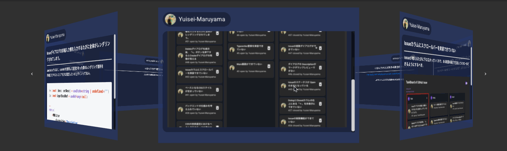
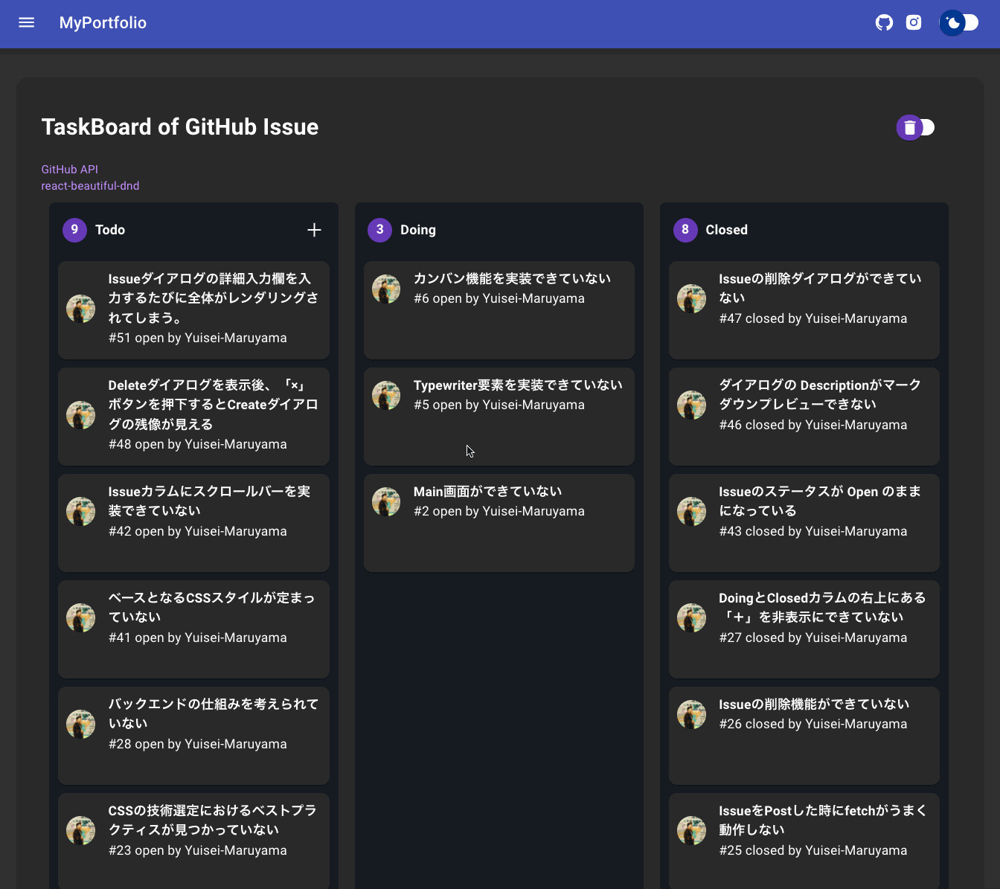
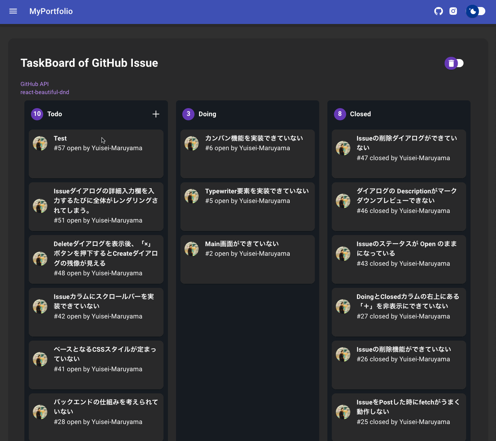
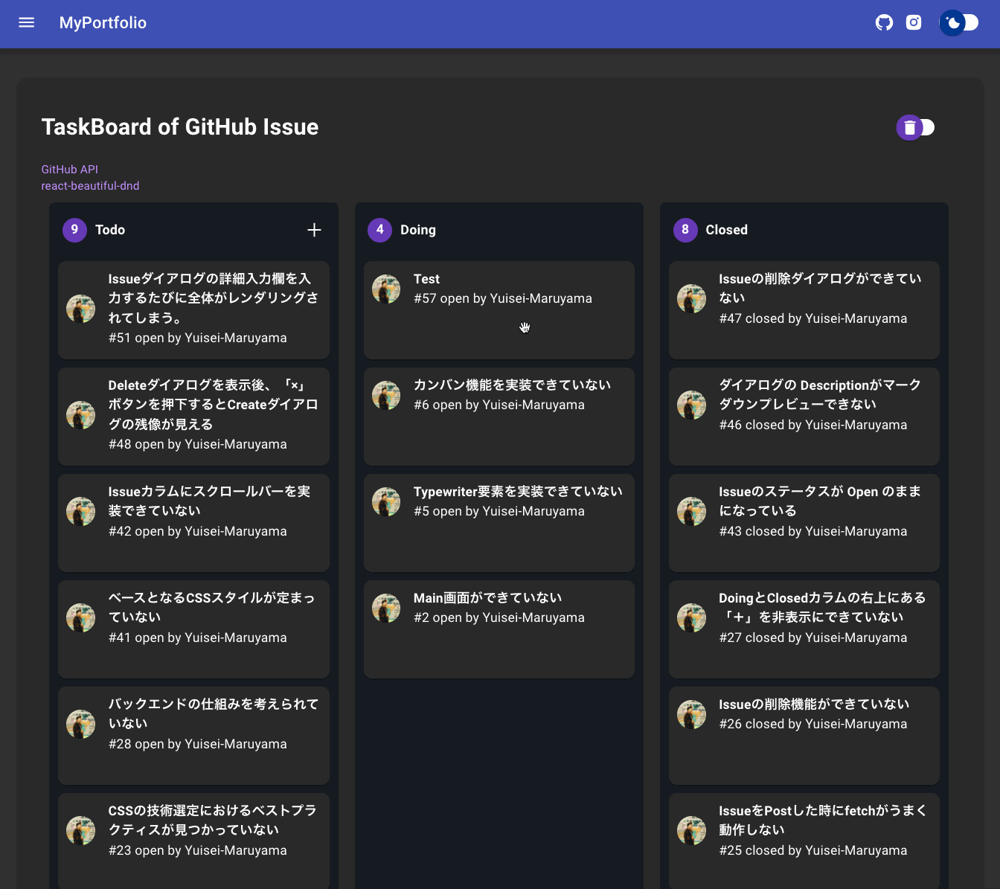

# My Portfolio

## Portfolio URL

https://yuisei-maruyama.work/

## 目的

自己紹介と開発におけるタスク管理を兼ねる意図で作成。  

### 開発におけるタスク管理画面の作成経緯

下記の2点の経緯からタスク管理画面の作成を行った。

- 当初、タスクの管理として `GitHub Projects` のかんばん機能を利用していたが、  
Issueに付与されたラベルごとの管理がしづらいことや対象となる`Issue`を編集やコメント記入する際のアクションが多かった点

- Issueの管理を行う為に毎回、`GitHub`のページに移動しなければいけないのは億劫であると感じた点

## 要件定義

### 機能一覧

| 機能 |
| --- |
| GitHub Issue のTodoラベル内容閲覧機能  |
| GitHub Issue の新規作成機能  |
| GitHub Issue に付与されたラベルごとの管理機能 |
| スイッチでメインカラーを切り替えられる機能 |

---

> GitHub Issue のTodoラベル内容閲覧機能
>> GitHub Issue に付与されたTodoラベルの内容からタイトルと詳細内容が閲覧可能  
>> Issueタイトルをクリックすることで該当Issueに遷移可能

> GitHub Issue の新規作成

> 付与されたラベルごとの管理機能

>> ドラッグ＆ドロップにおけるラベルの修正  

ex.) Todo -> Doing ラベルに変更  

ex.) Doing -> Closed ラベルに変更  

### 使用技術・バージョン
| 技術 | version |説明 |
| --- | --- | --- |
| react | 17.0.2 | ユーザインタフェース構築のためのJavaScriptライブラリ |
| typescript | 4.1.2 | JavaScriptに対して、静的型付けとクラスベースオブジェクト指向を加えた言語 |
| react-router-dom | 5.2.0 | ルーティングを定義するためのライブラリ |
| [react-app-rewired](https://www.npmjs.com/package/react-app-rewired) | 2.1.8 | webpack の設定を上書きしてエイリアス設定しているパスの解決を行う |
| react-beautiful-dnd | 13.1.0 | ドロップ&ドラッグを実現できるライブラリ |
| [react-vertical-timeline-component](https://stephane-monnot.github.io/react-vertical-timeline/#/) | 3.5.2 | タイムライムの表示 |
| axios | 0.24.0 | PromiseベースのHTTP Clientライブラリ |
| uuid | 8.3.2 | uuidを付与する |
| sass | 1.45.1 | Sass をコンパイルするためのモジュール |
| sass-loader | 12.4.0 | Sass を CSS へ変換するためのモジュール |
| tslib | 2.3.1 | コンパイル後のjsファイルが大きくなるのを防ぐ |
| eslint | 7.32.0 | コードの解析 |
| eslint-config-prettier | 8.3.0 | ESLint と Prettierを併用する |
| prettier | 2.4.1 | コードの整形 |
| @typescript-eslint/parser | 4.31.1 | ESLintをTypescriptで解析できるようにする |
| @typescript-eslint/eslint-plugin | 4.31.1 | ESLintでTypescriptのチェックを行う |
| husky | 4.3.8 | Gitコマンドフックに別のコマンドを呼び出せる |
| lint-staged | 11.1.2 | commitしたファイル(Stagingにあるファイル)にlintを実行する |
| [react-icons](https://react-icons.github.io/react-icons) | 4.2.0 | `Ant Design` や `Material Design`などを集めたアイコンの宝庫 |
| [dts-gen](https://github.com/microsoft/dts-gen) | 0.6.0 | ライブラリで型定義ファイルがない場合に `XXX.d.ts` を生成する |
|  | | |
|  | | |
|  | | |
### 動作環境

| デバイスの識別 | OS | 対応ブラウザ |
| --- | --- |--- |
| PC | macOS Mojave | Google chrome最新 |

## 基本設計

### サイトマップ

#### 画面名

| 画面名 | URI |
| --- | --- |
| ヘッダー | - |
| メイン画面 | / |
| タスク管理ボード画面 | /board |

