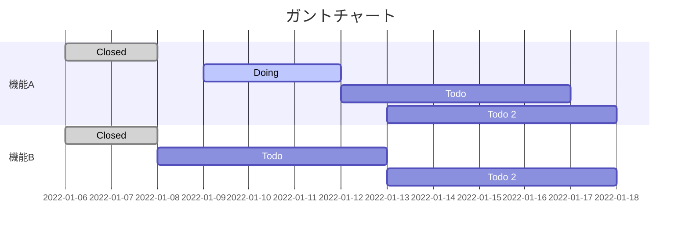

# Mermaid

## Mermaid とは?

**Mermaid とは、テキストとコードを使用して図と視覚化をマークダウンで実現できるツール。**

## FlowChart 

  > フローチャート部品
  
  (コード)
  ```typescript
  flowchart LR
  A[状態1] --> B(状態2)
  C{状態3} --> D([状態4])
  E[[状態5]] --> F[(状態6)]
  G((状態7)) --> H>状態8]
  I[/状態9/] --> J[\状態10\]
  K[/状態11\] --> L[\状態12/]
  ```

  (表示)
  ```mermaid
  flowchart LR
  A[状態1] --> B(状態2)
  C{状態3} --> D([状態4])
  E[[状態5]] --> F[(状態6)]
  G((状態7)) --> H>状態8]
  I[/状態9/] --> J[\状態10\]
  K[/状態11\] --> L[\状態12/]
  ```
   <br>

  > Node

  (コード)
  ```typescript
  flowchart LR
  A --> B
  C --- D
  E -->|矢印つきテキスト| F
  G -- テキスト --- H
  I == 太線 === J
  K -. 点線 -.- L
  M == 太い矢印 ==> N
  O -. 点線矢印 .-> P
  Q -- 丸矢印 --o R
  S -- x矢印 --x T
  U <-->|双方向矢印| V
  W x--x|双方向矢印| X
  Y o--o|双方向矢印| Z
  ```

  (表示)
  ```mermaid
  flowchart LR
  A --> B
  C --- D
  E -->|矢印つきテキスト| F
  G -- テキスト --- H
  I == 太線 === J
  K -. 点線 -.- L
  M == 太い矢印 ==> N
  O -. 点線矢印 .-> P
  Q -- 丸矢印 --o R
  S -- x矢印 --x T
  U <-->|双方向矢印| V
  W x--x|双方向矢印| X
  Y o--o|双方向矢印| Z
  ```
  <br>

  > Grouping

  (コード)
   ```typescript
   flowchart TB
    C1-->A2
    subgraph one
    A1-->A2
    end
    subgraph two
    B1-->B2
    end
    subgraph three
    C1-->C2
    end
   ```

  (表示)
   ```mermaid
   flowchart TB
    C1-->A2
    subgraph one
    A1-->A2
    end
    subgraph two
    B1-->B2
    end
    subgraph three
    C1-->C2
    end
   ```

## ガントチャート

`タスク名 : (進捗フラグ,) エイリアス(省略名), タスクの開始日時, 終了日時 or 開始日時からの期間` で表現できる！  

`after des1, 5d` とすれば、 **「des1タスクが終わってから 5日後から」** という意味合いになる。

(コード)
```typescript
gantt
dateFormat  YYYY-MM-DD
title ガントチャート

section 機能A
Closed            :done,    des1, 2022-01-06,2022-01-08
Doing        　  :active,  des2, 2022-01-09, 3d
Todo            :         des3, after des2, 5d
Todo 2          :         des4, after des3, 5d

section 機能B
Closed           :done,    des1, 2022-01-06,2022-01-08
Todo           :         des3, after des1, 5d
Todo 2         :         des4, after des3, 5d
```

(表示)
